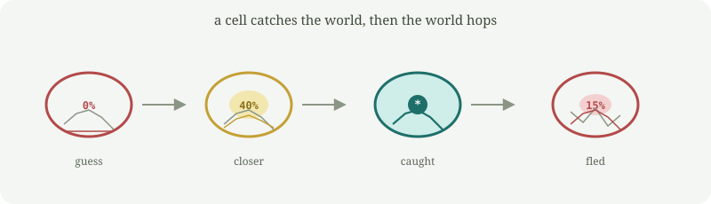

# reinante

A small Rust program that rewrites a piece of its own source while **the target itself keeps moving**.

It is not a language model and it does not spread by itself. You point it at a folder; it only writes there.

It is a sibling of [improver](https://github.com/PascualMacana/improver). Darwin still proposes (random mutants, same prefix language). The Red Queen is the world: when the brain matches, the scoring function mutates, and the fit is gone. You have to keep running to stay in the same place.

The part that evolves is a tiny math expression called the **brain**. It tries to match another expression, the **world**, on `x = -5 … 5`. Score is the sum of squared errors (**sse**). Lower is better. Zero is a catch — and then the world hops.

```
parent    brain  0                              world  x² + 3x + 5     sse  4323
  │ evolve
  │ catch
  ▼
          brain  (+ (+ (* 3 x) (* x x)) 5)      world  x² + 3x + 5     sse  0
  │ the world mutates
  ▼
child     brain  (+ (+ (* 3 x) (* x x)) 5)      world  (moved)         sse  > 0
```

The first world is the same polynomial the siblings freeze. After a catch it is not.



Watch it happen in the terminal. One cell, filling as the error drops. When it catches, the target curve moves and the body drains. `dish` defaults to seed 7, which catches the opening world in a few steps, then has to chase again.

```bash
cargo run -- dish
```

## Run it

You need [Rust](https://rustup.rs/).

```bash
cargo build --release
./target/release/reinante identity
./target/release/reinante evolve --steps 120 --spawn ./hijo --build
./hijo/target/debug/reinante identity
```

`identity` prints generation, brain, world, flees, and score.  
`evolve --spawn ./hijo --build` searches, lets the world hop when caught, and writes a child crate that inherits both brain and world.

## Commands

```
reinante identity              generation, lineage, brain, world, flees, score
reinante eval [x]              brain vs the current world
reinante evolve                search; the world hops on a catch
                 --steps N      search steps (default 120)
                 --lambda L     mutants per step (default 30)
                 --seed S       reproducible RNG
                 --spawn <dir>  write a child with the ending brain and world
                 --build        compile that child
                 --force        overwrite a previous child
                 --write        update src/main.rs in this project
reinante dish                  animate a cell that fills and drains
                 --steps N      search steps (default 120)
                 --lambda L     mutants per step (default 30)
                 --seed S       default 7 (the reliable demo)
                 --delay MS     ms per frame (default 80)
reinante spawn <dir>           copy the current genome (no search)
reinante genome                print the embedded sources
```

`--spawn` leaves this program alone and writes a selected child.  
`--write` edits this project's `src/main.rs`; rebuild so the binary picks up the new brain and world.

## How it works

The brain and the world both live as prefix expressions in `src/main.rs`: `x`, small integers, `+`, `-`, `*`.

1. Parse the current brain and world into trees.
2. Each step makes several random brain mutants. Keep the lowest `sse + 0.01 × size` against the **current** world.
3. After a perfect fit, algebraic identities may shrink the brain.
4. Then the world mutates. If the brain is no longer perfect, that hop counts as a flee.
5. With `--spawn`, write a full Cargo project whose source contains that brain **and** that world.

There is no frozen ceiling. A child is born into the world it was chasing, not into `x² + 3x + 5` forever.

This is not Schmidhuber's Gödel Machine and it is not a proof: there is no certificate. For that, see [prover](https://github.com/PascualMacana/prover). The siblings freeze the evaluator; this one does not.

## Safety

- One child per run. No background loops, no network.
- It will not write over your home directory, `/`, `/usr`, `/etc`, or the directory you are standing in.
- `--force` only deletes a folder that already looks like a `reinante` project.

## Related

[replicator](https://github.com/PascualMacana/replicator) copies itself.  
[improver](https://github.com/PascualMacana/improver) copies itself and also tries to improve, against a frozen target.  
[prover](https://github.com/PascualMacana/prover) only writes a claimed improvement when a checkable proof says so.  
[crosser](https://github.com/PascualMacana/crosser) keeps the river crossings that were still legal.  
[inquirer](https://github.com/PascualMacana/inquirer) keeps the house assignments the clues did not refute.  
[tide](https://github.com/PascualMacana/tide) keeps searching because the river's rules hop.  
[sealer](https://github.com/PascualMacana/sealer) only writes a river plan when a proof says it improved.  
[turn](https://github.com/PascualMacana/turn) keeps searching because the house clues hop.
